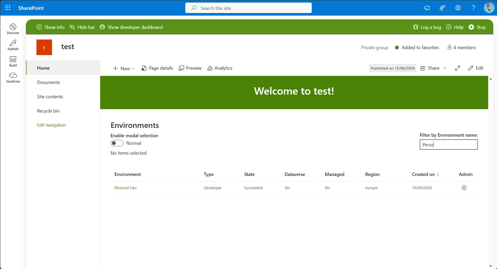
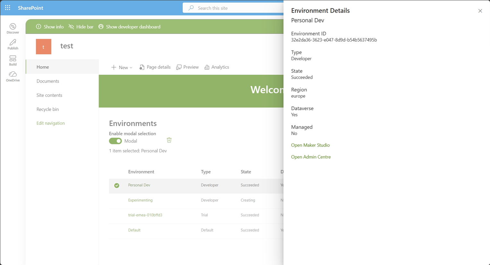
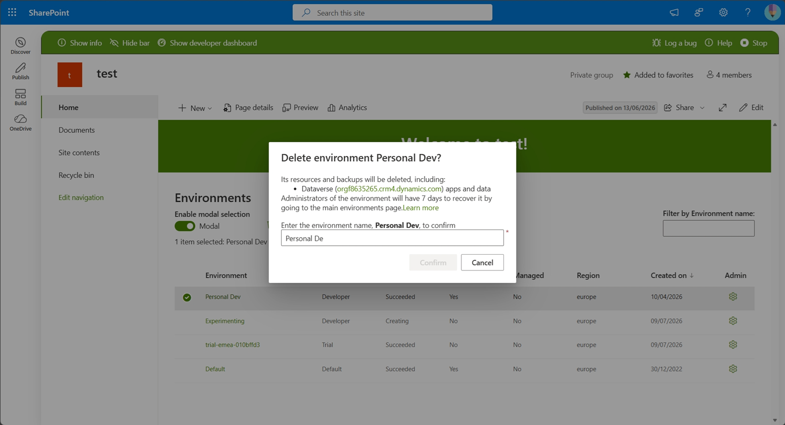

# Power Platform Environments

## Summary

Power Platform Environments provides a SharePoint Framework (SPFx) web part for discovering and managing Microsoft Power Platform environments directly from SharePoint.

The sample presents environments in a Fluent UI DetailsList and provides:

- Environment discovery
- Column sorting
- Environment filtering
- Environment details panel
- Power Platform Admin Center integration
- Power Apps Maker Studio integration
- Environment deletion using Power Platform APIs
- Success and error notifications using Fluent UI MessageBars

## Compatibility

| :warning: Important          |
|:---------------------------|
| Every SPFx version is optimally compatible with specific versions of Node.js. In order to be able to Toolchain this sample, you need to ensure that the version of Node on your workstation matches one of the versions listed in this section. This sample will not work on a different version of Node.|
|Refer to <https://aka.ms/spfx-matrix> for more information on SPFx compatibility.   |

This sample is optimally compatible with the following environment configuration:

-Incompatible-red.svg "SharePoint Server 2016 Feature Pack 2 requires SPFx 1.1")

## Applies to

* [SharePoint Framework](https://learn.microsoft.com/sharepoint/dev/spfx/sharepoint-framework-overview)
* [Microsoft 365 tenant](https://learn.microsoft.com/sharepoint/dev/spfx/set-up-your-development-environment)

> Get your own free development tenant by subscribing to [Microsoft 365 developer program](https://aka.ms/m365/devprogram)

## Contributors

* [joshua](https://github.com/brayjosh)

## Version history

|Version|Date|Comments|
|-------|----|--------|
|1.0|July 14, 2026|Initial release|

## Prerequisites

The signed-in user must have sufficient permissions to view and manage Power Platform environments.

Examples include:

- Power Platform Administrator
- Environment Administrator
- Global Administrator

Additional permissions may be required depending on the Power Platform APIs being used.

## Minimal path to awesome

* Clone this repository (or [download this solution as a .ZIP file](https://pnp.github.io/download-partial/?url=https://github.com/pnp/sp-dev-fx-webparts/tree/main/samples/react-power-platform-environments) then unzip it)
* From your command line, change your current directory to the directory containing this sample (`react-power-platform-environments`, located under `samples`)
* in the command line run:
  * `npm install`
  * `npm run start`

> This sample can also be opened with [VS Code Remote Development](https://code.visualstudio.com/docs/remote/remote-overview). Visit <https://aka.ms/spfx-devcontainer> for further instructions.

## Features

This sample demonstrates the following concepts on top of the SharePoint Framework:

- Fluent UI DetailsList
- Fluent UI Dialog
- Fluent UI Panel
- Fluent UI MessageBar
- Power Platform Administration APIs
- Power Platform Environment Management
- Environment lifecycle operations
- Client-side filtering
- Client-side sorting
- SPFx 1.23.0
- React

## Help

We do not support samples, but this community is always willing to help, and we want to improve these samples. We use GitHub to track issues, which makes it easy for  community members to volunteer their time and help resolve issues.

If you're having issues building the solution, please run [spfx doctor](https://pnp.github.io/cli-microsoft365/cmd/spfx/spfx-doctor/) from within the solution folder to diagnose incompatibility issues with your environment.

You can try looking at [issues related to this sample](https://github.com/pnp/sp-dev-fx-webparts/issues?q=label%3A%22sample%3A%20react-power-platform-environments%22) to see if anybody else is having the same issues.

You can also try looking at [discussions related to this sample](https://github.com/pnp/sp-dev-fx-webparts/discussions?discussions_q=react-power-platform-environments) and see what the community is saying.

If you encounter any issues using this sample, [create a new issue](https://github.com/pnp/sp-dev-fx-webparts/issues/new?assignees=&labels=Needs%3A+Triage+%3Amag%3A%2Ctype%3Abug-suspected%2Csample%3A%20react-power-platform-environments&template=bug-report.yml&sample=react-power-platform-environments&authors=@brayjosh&title=react-power-platform-environments%20-%20).

For questions regarding this sample, [create a new question](https://github.com/pnp/sp-dev-fx-webparts/issues/new?assignees=&labels=Needs%3A+Triage+%3Amag%3A%2Ctype%3Aquestion%2Csample%3A%20react-power-platform-environments&template=question.yml&sample=react-power-platform-environments&authors=@brayjosh&title=react-power-platform-environments%20-%20).

Finally, if you have an idea for improvement, [make a suggestion](https://github.com/pnp/sp-dev-fx-webparts/issues/new?assignees=&labels=Needs%3A+Triage+%3Amag%3A%2Ctype%3Aenhancement%2Csample%3A%20react-power-platform-environments&template=suggestion.yml&sample=react-power-platform-environments&authors=@brayjosh&title=react-power-platform-environments%20-%20).

## Disclaimer

**THIS CODE IS PROVIDED *AS IS* WITHOUT WARRANTY OF ANY KIND, EITHER EXPRESS OR IMPLIED, INCLUDING ANY IMPLIED WARRANTIES OF FITNESS FOR A PARTICULAR PURPOSE, MERCHANTABILITY, OR NON-INFRINGEMENT.**

