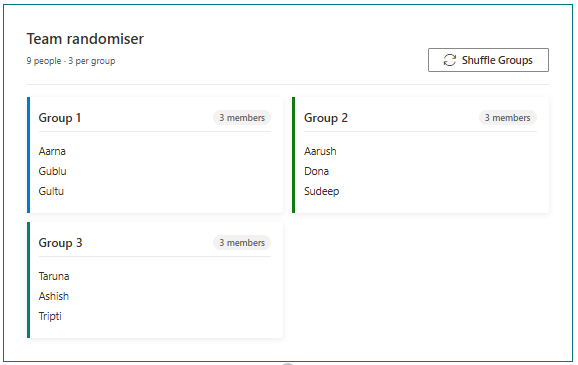

# Team Randomiser

## Summary

Randomly assign people into evenly-sized groups with a single click. Enter a list of names and a desired group size; the web part shuffles them and displays colour-coded group cards. Hit **Shuffle Groups** to re-randomise at any time.



## Compatibility

| :warning: Important          |
|:---------------------------|
| Every SPFx version is only compatible with specific version(s) of Node.js. In order to be able to build this sample, please ensure that the version of Node on your workstation matches one of the versions listed in this section. This sample will not work on a different version of Node.|
|Refer to <https://aka.ms/spfx-matrix> for more information on SPFx compatibility.   |


-Incompatible-red.svg)


## Applies to

- [SharePoint Framework](https://aka.ms/spfx)
- [Microsoft 365 tenant](https://docs.microsoft.com/en-us/sharepoint/dev/spfx/set-up-your-developer-tenant)

## Contributors

- [Sudeep Ghatak](https://github.com/sudeepghatak)

## Version history

| Version | Date | Comments |
| ------- | ---- | -------- |
| 1.0.0 | July 2026 | Initial release |

## Features

- Enter any number of names (one per line) via the property pane
- Configure the desired number of people per group (2–20)
- Randomly assigns people into groups on load and on every shuffle
- Groups are capped at the configured size; any remainder forms a smaller final group
- Colour-coded group cards for quick visual distinction
- Optional web part title displayed above the group cards
- Accessible via Fluent UI components

## Property Pane Options

| Property | Type | Description |
| -------- | ---- | ----------- |
| Title | Text | Optional heading displayed above the groups |
| Names | Multi-line text | One name per line |
| People per group | Slider (2–20) | Maximum number of people in each group |

## Minimal Path to Awesome

- Clone this repository
- Navigate to the sample folder:
  ```bash
  cd samples/react-team-randomiser
  ```
- Install dependencies:
  ```bash
  npm install
  ```
- Build and bundle:
  ```bash
  gulp bundle --ship
  gulp package-solution --ship
  ```
- Upload `sharepoint/solution/react-team-randomiser.sppkg` to your tenant App Catalog
- Add the **Team Randomiser** web part to any SharePoint page

### Local Development

```bash
gulp serve
```

Then open the hosted workbench (`https://<your-tenant>.sharepoint.com/_layouts/15/workbench.aspx`) and add the web part.

### Running Tests

```bash
npm test
```

## Help

We do not support samples, but this community is always willing to help, and we want to improve these samples. We use GitHub to track issues, which makes it easy for community members to volunteer their time and help resolve issues.

You can try looking at [issues related to this sample](https://github.com/pnp/sp-dev-fx-webparts/issues?q=label%3A%22sample%3A%20react-team-randomiser%22) to see if anybody else is having the same issues.

You can also try looking at [discussions related to this sample](https://github.com/pnp/sp-dev-fx-webparts/discussions?discussions_q=react-team-randomiser) and see what the community is saying.

If you encounter any issues while using this sample, [create a new issue](https://github.com/pnp/sp-dev-fx-webparts/issues/new?assignees=&labels=Needs%3A+Triage+%3Amag%3A%2Ctype%3Abug-suspected%2Csample%3A%20react-team-randomiser&template=bug-report.yml&sample=react-team-randomiser&authors=@sudeepghatak&title=react-team-randomiser%20-%20).

For questions regarding this sample, [create a new question](https://github.com/pnp/sp-dev-fx-webparts/issues/new?assignees=&labels=Needs%3A+Triage+%3Amag%3A%2Ctype%3Aquestion%2Csample%3A%20react-team-randomiser&template=question.yml&sample=react-team-randomiser&authors=@sudeepghatak&title=react-team-randomiser%20-%20).

Finally, if you have an idea for improvement, [make a suggestion](https://github.com/pnp/sp-dev-fx-webparts/issues/new?assignees=&labels=Needs%3A+Triage+%3Amag%3A%2Ctype%3Aenhancement%2Csample%3A%20react-team-randomiser&template=question.yml&sample=react-team-randomiser&authors=@sudeepghatak&title=react-team-randomiser%20-%20).

## Disclaimer

**THIS CODE IS PROVIDED *AS IS* WITHOUT WARRANTY OF ANY KIND, EITHER EXPRESS OR IMPLIED, INCLUDING ANY IMPLIED WARRANTIES OF FITNESS FOR A PARTICULAR PURPOSE, MERCHANTABILITY, OR NON-INFRINGEMENT.**


